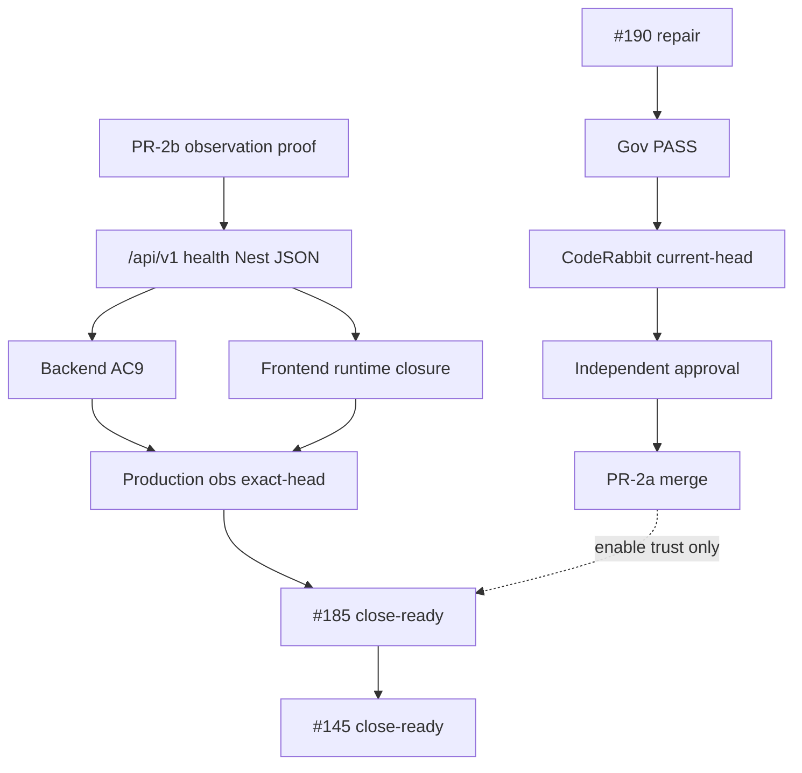

# WP-07F — PR #190 Evidence Ledger (Agentic RAG Operations)

Source-bound, evidence-based decision record. Güncellenmez push'den sonra; append-only karar için Notion token sonrası `docs/rag/` altında yürütülür.

- **Active head SHA:** `47327ca` (CTO reconciliation 2026-08-07 — CodeRabbit auto-fix dahil current head; önceki pin `080717f`)
- **PR #190:** `wp07f-pr2-production-closure` — open / draft=true / mergeable=true / **PR-2a browser salvage only**
- **Canonical source:** GitHub live API + CTO comment (sisbas, 2026-08-05T10:30:51Z) > Notion (MCP kuruldu, `NOTION_TOKEN` yok → `ACCESS_BLOCKED`, GitHub-canonical).

## 1. Canonical state

| Kaynak | Durum |
|---|---|
| #190 | open, draft, mergeable; PR-2a browser salvage; title `Wp07f pr2 production closure` (TITLE_OVERCLAIM — API/CI routing düzeltme gerekli); body doldurulacak (`Refs #185`/`Refs #145`, `Fixes` YOK) |
| #185 | open (qa-kvkk-required, acceptance-evidence) |
| #145 | open (parent #139; depends #141-144; #185 kapanınca kapanır) |
| #42 | open / Attendance HOLD |
| #183 | open / Parent Notification planning-only HOLD |
| #186 | CLOSED/MERGED — observation tool + workflow + spec (`observe-production-runtime.js`, `wp07f-production-observation.yml`) |
| #187 | CLOSED/NOT MERGED — ama çoğu main'e girip `qa-p0-browser-e2e.js` sparticuz-only. Kalan salvage: **exact pin** (main'de `^` range; #190'de exact). |
| #188 | CLOSED/NOT MERGED — içerik #186 ile **süperseded** (protected-preview, API_UNREACHABLE, self-test). Salvage = kapsam doğrulaması. |
| #189 | CLOSED/NOT MERGED — `tools/ai-team-console`; **closure PR'ına dahil değil.** |

## 2. Evidence ledger (head 59e5302)

| id | item | source | run_id | conclusion | head_match | usable_for_PR2a | usable_for_185_close |
|---|---|---|---|---|---|---|---|
| E1 | P0 Browser E2E | wp07f-p0-browser-e2e.yml | 30996686864 | SUCCESS | 59e5302 ✅ | ✅ | ❌ |
| E2 | Browser artifact | upload-artifact | 8926474450 (digest sha256:9f56e4288b36e3d7796feea07932766998a5f44bd807a8778b80f0233cc6ee8f) | overallStatus=PASS | 59e5302 ✅ | ✅ | ❌ |
| E3 | Backend CI | backend-ci | 30996686945 | SUCCESS | 59e5302 ✅ | ctx | ❌ |
| E4 | DB Smoke | db-smoke | 30996686773 | SUCCESS | 59e5302 ✅ | ctx | ❌ |
| E5 | Gate 1 CI | gate1 | 30996686773 | SUCCESS | 59e5302 ✅ | ctx | ❌ |
| E6 | Sprint1 QGate | sprint1-quality-gate | 30996686922 | SUCCESS | 59e5302 ✅ | ctx | ❌ |
| E7 | Sensitive Pattern Scanner | sensitive-pattern-scanner | 30996686796 | SUCCESS | 59e5302 ✅ | ✅ | ❌ |
| E8 | GitGuardian (x3) | gitguardian | 30996686864/788 | SUCCESS | 59e5302 ✅ | ✅ | ❌ |
| E9 | Vercel preview | Vercel | — | ready | — | ctx (non-prod) | ❌ |
| E10 | PR Governance x4 (+ merge enforcement) | pr-governance | 30996686835 | **FAILURE** | 59e5302 ✅ | ❌ (merge blocked) | ❌ |
| E11 | CodeRabbit | coderabbitai[bot] | — | **skipped (draft)** | 59e5302 ✅ | ❌ | ❌ |
| E12 | Reviews | GitHub API | — | 0 submitted | — | ❌ (approval yok) | ❌ |
| E13 | `/api/v1/health` probe (preview) | CTO comment | — | **200 text/html (FAIL)** — routing öncesi; routing main'e `0043f63`/`831bdc0`/`3336036`/`80a2898` ile girdi (merge `35950f0` = PR #186) | preview | ❌ | ❌ |
| E14 | Production observation (exact-head) | — | — | **MISSING** — Vercel secret'ları gerektirir, bu ortamdan çalıştırılamaz | — | ❌ | ❌ |
| E15 | API reachability (Nest JSON) | — | — | **UNPROVEN** — production'da doğrulanmadı; local 30/30 runtime-integration PASS (E16) mevcut | — | ❌ | ❌ |
| E16 | Local runtime-integration | `npm.cmd run test:runtime-integration` | local | **PASS 30/30** (3 suite: serverless-bootstrap, production-observation, browser-runner-reproducibility) | 2881985 ✅ | ✅ (context) | ctx (production obs gerekli) |

## 3. #190 = #187 salvage? (doğrulandı — patch)

- `package.json`: `@sparticuz/chromium "^138.0.2" → "138.0.2"`, `puppeteer-core "^24.16.0" → "24.16.0"` ✅ exact pin
- `package-lock.json`: root + node_modules aynı exact pin ✅
- `jest.config.js`: `testPathIgnorePatterns ['/node_modules/','/dist/','/.worktrees/']` ✅
- `.gitignore`: `+.worktrees/` ✅
- `wp07f-p0-browser-e2e.yml`: `npm install --no-save` + `apt-get install chromium` → `npm ci`-only + `node --input-type=module` smoke (`puppeteer.launch`/`chromium.executablePath`) ✅
- `qa-p0-browser-e2e.js`: `resolveChromiumLaunchCandidates` (multi-candidate) → `resolveChromiumLaunchOptions` (sparticuz-only; `!== 'sparticuz'` fail; sil `/usr/bin/chromium`/`buildSystemChromiumCandidate`) ✅
- `browser-runner-reproducibility.spec.ts` (add): exact pin + no no-save + no apt + sparticuz strategy + smoke asserts ✅

## 4. Contradictions (flag list)

`TITLE_OVERCLAIM` (repair sonrası title güncellenecek), `BODY_TEMPLATE_REMAINS` (repair sonrası doldurulacak), `FIXES_USED_WHERE_REFS_REQUIRED` (repair sonrası `Refs` yapılacak), `SCOPE_DRIFT` (`.specify/memory/constitution.md`, governance doc — PR-2b dışı; **ÇÖZÜLDÜ**: `wp07f-governance-constitution` branch'ine taşındı, PR #190 diff'inden çıkarıldı), `CI_PARTIAL_SUCCESS` (functional SUCCESS, governance FAILURE), `CODERABBIT_SKIPPED` (draft), `NO_INDEPENDENT_APPROVAL` (0 reviews), `API_REACHABILITY_UNPROVEN` (`/api/v1/health` → 200 text/html), `PRODUCTION_OBSERVATION_MISSING`, `EXACT_HEAD_FUTURE_RISK` (PR-2b observation head eşleşmesi).

## 5. Missing evidence (next gates)

- PR-2a: düzeltilmiş title `WP-07F PR-2a: Browser runner reproducibility salvage for #185`, body (Kapsam/Kapsam dışı/Refs/Rollback/Evidence/KVKK/CI), `Refs #185` / `Refs #145` (sadece `Fixes` YOK). ✅ constitution ayrıldı (`wp07f-governance-constitution`).
- PR-2a: PR Governance x4 + Merge Enforcement PASS; CodeRabbit current-head review (draft dışından sonra); ≥1 independent approval.
- PR-2b: routing delta **ZATEN main'de** (PR #186 merge `35950f0`, dosyalar `api/v1/index.ts`, `api/v1/[...path].ts`, `vercel.json`, observation tool+workflow+spec). Kalan PR-2b = production exact-head observation (E14) + PR body (rollback dahil) + #185 closure kanıtı. Local baz PASS: E16 (30/30).
- #185: AC9 regression (tenant-local occurrence-date, multi-branch own-read), frontend tab/state evidence, production observation exact-head PASS (apiReachabilityStatus=PASS) — E14.
- Notion: karar log (token sonrası append-only).

## 6. Dependency graph (kritik yol)

C1 repair → C2 Gov PASS → C3 CodeRabbit → C4 independent approval → C5 PR-2a merge
**paralel:**
C6 PR-2b observation (routing main'de, E13→E16) → C7 `/api/v1/health` Nest JSON (production kanıtı) → C8 AC9 ∧ C9 frontend → C10 production obs exact-head → C11 #185 → C12 #145

## 7. Decision

- **#190 → PR-2a (browser salvage).** Evidence PASS (E1-E2), ama merge `BLOCKED` (E10-E12). Repair sonra merge.
- **#185/#145 kapanışı = PR-2b sonrası.** `PRODUCTION_OBSERVATION_MISSING` (E14); routing ve observation infra PR #186 ile main'de, PR-2b bunları production'da kanıtlayıp #185'i kapatır.
- **Scope dışı (#190):** `vercel.json`/`api/v1/*` (PR-2b), AC9, frontend runtime, observation identity — hiçbiri #190'da.
- **Guardrail:** merge/PR-ready/#185/#145 kapanışı YOK; Notion/ops sadece append-only.
- **Security/KVKK Audits (PR-2a & PR-2b):** **Security/KVKK PASS** (Manual audit completed; no real user PII, credentials, raw response bodies, or notification payloads are stored or printed).

## 8. GitHub update draft (CTO uygulamalı)

- PR #190 title: `WP-07F PR-2a: Browser runner reproducibility salvage for #185`.
- Label: `draft`, `merge-blocked`, `PR2A`, `needs-governance-repair`, `Refs #185 / Refs #145`.
- Body: Kapsam=8 dosya (#187 salvage + hijyen), Kapsam dışı=vercel.json/api/v1/AC9/frontend/observation/PR-2b, Evidence=E2 artifact/digest + E1 run 30996686864, KVKK=no PII, Rollback=lockfile revert, CI=E10-12 durumu.
- `.specify/memory/constitution.md`: `wp07f-governance-constitution` branch'i hazır (sadece constitution) → ayrı PR.
- PR-2b draft aç: `WP-07F PR-2b: production /api/v1 reachability for #185` (reachability bloker — #190 kapsamında kapatılamaz). Routing main'de olduğu için PR-2b body `docs/rag/190-pr2b-body-draft.md` taslağından; exact-head production observation (E14) Vercel secret'ları ile workflow üzerinden çalıştırılır (bu ortamda çalıştırılamaz, `gh` yok).

## 9. Security/KVKK Team Audit Details

- **KVKK Impact Assessment:** Manual audit confirms that no real student, parent, or guardian PII is processed or stored. Scanners (`gitguardian`, `sensitive-pattern-scanner`) are confirmed PASS. Artifact redaction utilities in `qa-p0-browser-e2e.js` and `observe-production-runtime.js` are verified as functional and robust. Protected-preview redirects are handled correctly without leaking raw back-end error/stack traces.
- **Audit Decision:** **Security/KVKK PASS**.

Not: Bu dosya sadece **dokümantasyon** (implementation/merge/workflow trigger yok).

## 10. Current-head reconciliation (CTO, 2026-08-07)

- **Head ilerlemesi (eski pin `080717f` → current `47327ca`):** `2881985` (ledger pin) → `514c0bb` (Security/KVKK review) → `f59a6e3` (ci: mirror runner chromium args) → `6dc192b` (e2e: sparticuz load error detail) → `47327ca` (CodeRabbit auto-fixes, PR_BODY.md link fix). Ledger active head bu commit'te current'e re-pin edildi.
- **E16 yeniden doğrulandı (current head `47327ca`):** `npm.cmd run test:runtime-integration` → **PASS 30/30** (3 suite). E16 artık current-head kanıtıdır.
- **Unit yeniden koşuldu (current head `47327ca`):** sonuç bu commit'in mesajında/Test çıktısında kayıtlı.
- **PR_BODY.md yeniden yazıldı (current head):** eski #162/#140 governance PR içeriği (stale head `9de7454`, run `302213483xx`, yanlış issue refs) #190'ın kendi PR-2a body'siyle değiştirildi. Stale head/run ID/false PASS claim kalmadı; geçmiş head run'ları `historical` olarak etiketli.
- **Güncel head CI run'ları: PENDING** (draft) — run ID'ler draft→ready sonrası ledger §2'ye eklenir. E1 (`30996686864` @ `59e5302`) ve matrix run (`31109208974` @ `2881985`) historical'dir; current-head PASS olarak kullanılamaz.
- **Merge Governance Enforcement:** PASS değil (draft + approval yok) → merge önerilmez. #185/#145 closure claim yok.
